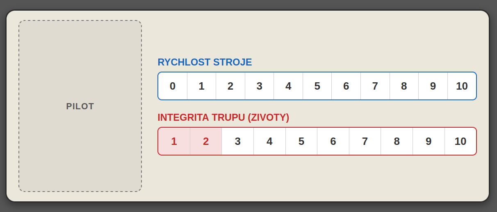

# Pravidla hry
- [Pravidla hry](#pravidla-hry)
  - [Mapa](#mapa)
  - [Cíl hry](#cíl-hry)
  - [Obsah hry](#obsah-hry)
  - [Dopravní prostředky](#dopravní-prostředky)
    - [Pilotní licence](#pilotní-licence)
    - [Pohyb](#pohyb)
    - [Stavba a vylepšení](#stavba-a-vylepšení)
    - [Posádka](#posádka)
  - [Suroviny](#suroviny)
  - [Města](#města)
    - [Vylepšení měst](#vylepšení-měst)
  - [Události a Trh (Events)](#události-a-trh-events)
  - [Příprava hry](#příprava-hry)
  - [Tah Hráče](#tah-hráče)
    - [Boj](#boj)
    - [Obchod mezi hráči](#obchod-mezi-hráči)

Steampunkově/fantasy laděný "Pick-up and Deliver" spojený s "Tableau Building" (stavbou vlastního stroje z karet).

## Mapa

Pevná hexová síť reprezentující steampunkový svět. Hexy jsou rozděleny na pevninu, vodu a překážky (hory, hluboké oceány).

Topologie mapy obsahuje zúžená hrdla (chokepoints) jako jsou horské průsmyky a úžiny, které vynucují interakci mezi hráči.

Na mapě je rozmístěn pevný počet Měst (uzlů). Každé město má přiřazenou kartu své produkce a spouštěcí číslo pro hod kostkou (např. 2x6).

Města slouží jako překladiště, místa pro nabírání úkolů a loděnice pro přestavbu strojů.

Hráči putují po herních polích - hexagony (umožnují pohyb šesti směry).
A plní herní úkoly, získávají tak měnu a odměny v podobě vylepění.

## Cíl hry

Hra je ekonomický závod. Vítězí ten, kdo má na konci hry největší finanční hotovost (peníze = vítězné body). Hra okamžitě končí ve chvíli, kdy je z centrální nástěnky odebrán poslední úkol z balíčku Epochy III.

## Obsah hry

Pytlík s dřevěnými kostičkami surovin (Uhlí, Ruda, Součástky, Obilí).
Pilotní licence pro sledování stavu strojů. Kolíky pro rychlost a žetony pro životy.
Kameny pro vylepšení měst.
Symboly pro označení měst a jejich produkce.
Karty vylepšení rozdělené do tří Epoch (I, II, III) pro:
- lodě, vzducholodě, chodci

Karty úkolů rozdělené do tří Epoch (I, II, III).

## Dopravní prostředky

- Lodě
- Vzducholodě
- Streandbeast - Chodci

Z karet skládáte své stroje na přepravu. Díky tomu mají větší kampacitu rychlost a jiné bonusy.

Lodě mohou putovat jen po vodě (moře, řeky).

Chodci jen po pevnině a s krze brody úžiny.
- musejí se vyhnout horám a jezerům.

Vzducholodě mohou cestovat kdekoliv.

Každý dopravní prostředek začíná s přídí, zádí a jednou kajutou pro kapitána. 

Záď pohon,
Příd nákladový prostor,
Kajuta pro kapitána první středový díl.

Hráči mohou mít strojů kolik mají kapitánů. 

### Pilotní licence
Reprezentují stroj, jeho životy a rychlost.

Dvouvrstvý karton s výřezy pro dřevěné kostičky nebo kolíčky. Vzhledem k tomu, že se rychlost a životy budou neustále dynamicky měnit (přidáním modulu, naložením těžké suroviny nebo inkasováním zásahu), hráči potřebují "dashboard", kde tyhle proměnné okamžitě vidí.

Na této desce (licenci) můžeš trackovat:
- Aktuální rychlost: Posouváš kolíček, když přidáš motor nebo zátěž.
- Životy / Integritu: Ukazuje, kolik zásahů stroj vydrží.

### Pohyb

Každý modul (nákladový prostor, dělo, extra pancíř) bude mít kromě své funkce i atribut zátěž. Motory budou mít naopak atribut výkon.

Rychlost stroje: 

$\text{Rychlost} = \text{Celkový výkon} - \text{Celková zátěž}$

> Cílená mechanika:
> Hráč, který si postaví obří nákladní vlak plný děl, bude potřebovat masivní parní kotle, aby se vůbec pohnul o jeden hex. Naproti tomu kurýr na lehké vzducholodi s jedním motorem a malým skladem proletí mapu za dvě kola.

### Stavba a vylepšení

Stroj jde přestavět ve městě kde mají dílny. Hráče to stojí zbývající pohyb do konce tahu s daným prostředkem.

Stavba dopravního prostředku.
Hráč si z karet na ruce poskládá nový stroj. Můžete libovolně vyměněnovat a přesouvat moduly na svém stroji. Pokud jsou dva stroje stejného typu ve stejném městě, můžou mezi sebou vyměnovat moduly.

Po dokončení vylepšení/stavby prostředku hráč spočítá počet životů stroje a umístí odpovídající počet četonů života na pilotní licenci kapitána řídící daný stroj. 
Pak spočítá rychlost stroje a umístní kolíček rychlosti na odpovídající číslo na licenci.

Karta ubykace umožnuje přidat další posádku na stroj.

Nákladní prostor určuje kolik kostiček může být umístěno na loď. 

Mají:
- cenu,
- hmotnost,
- bonusy

### Posádka

Hráč začíná s jedním kapitánem (jeden stroj). Pokud si ve městě najme dalšího, může začít stavět druhý stroj a operovat na dvou místech mapy zároveň.

Členové posádky:
- mechanik (bonus k opravám),
- navigátor (bonus k pohybu),
- obchodník (bonus k obchodování),
- voják (bonus k boji).

## Suroviny

Města získávají zdroje. 
Kostičky různých barev se rozmístují po herní mapě. 

Herní suroviny:
- 🌑 Uhlí
- 🔴 Ruda
- ⚙️ součástky
- 🌾 obilý

Barvy kostiček:
- Uhlí: ⬛ (Černá)
- Ruda: 🟥 (Červená)
- Součástky: ⬜ (bílá/stříbrná)
- Obilí: 🟨 (Žlutá)

Na stroji může být maximálně tolik kusů surovin kolik uveze (kapacita nákladního prostoru). Každý surovina má váhu 1, která zvyšuje zátěž stroje a tím ho zpomaluje.
Při nakládání/vykládání surovin aktualizujte rychost pohybu vašeho stroje.

Na začátku tahu hráč hodí kostkami. Padne například pětka. Hráči se podívají na město s číslem 5, zjistí, jakou kartu produkce dostalo při počátečním losování (např. Rudu), a fyzicky do tohoto města položí jednu novou dřevěnou kostičku Rudy z banku. Tím se neustále doplňují sklady a hráči se o tyto nově vygenerované zdroje mohou začít okamžitě přetahovat.

## Města

### Vylepšení měst

Infrastrukturní úkoly v praxi
Když se na nástěnce objeví úkol typu "Stavba parního rypadla", bude mít v rohu specifickou ikonu. Vyžaduje obvykle vzácnější nebo objemnější materiál. Jakmile ho hráč splní, proběhnou dvě věci:

Hráč zinkasuje prémiovou odměnu (peníze/VB).

Hráč položí na dané město na mapě "Upgrade žeton". Od tohoto momentu město při svém hodu na kostce produkuje dvojnásobek.

Parní stroj 
Násobič (Více surovin)
Když na produkční kostce padne číslo tohoto města, nevygeneruje se 1 dřevěná kostička, ale 2 nebo 3.

Rozšíření produkce
Rozšíření pravděpodobnosti (Častější spouštění). Pokud má město na začátku přidělené spouštěcí číslo 5, upgrade mu přidá i číslo 6. Tím se drasticky zvyšuje šance, že město vyprodukuje suroviny, protože ho aktivuje více výsledků hodu.
Vylosování druhého číselného žetonu, který se umístí vedle toho původního. Když padne číslo na kterémkoliv z těchto žetonů, město vyprodukuje suroviny. 

## Události a Trh (Events)

- Epocha I (Zahájení): Nízké odměny, které slouží primárně k zisku startovního kapitálu pro nákup prvních lepších modulů (silnější motor, větší sklad).
- Epocha II (Industrualizace): Zde se poprvé začnou na nástěnce objevovat první Infrastrukturní úkoly, které zvednou produkci na mapě přesně ve chvíli, kdy hráči začínají mít větší lodě a potřebují víc surovin.
- Epocha III (Zlatý věk): Komplexní zakázky, hybridní požadavky a drahé komodity. Obrovské odměny, tvrdý boj o přežití a o finální body.

Balíček událotí obsahuje města a co se tam stalo. Úkoly - některá města požadují dodání určitých surovin.

Počet hráčů +2, pokud je splněn úkol, lízne se další úkol z balíčku.

+2 jsou jeden z II a jeden z III balíčku.

Když se vybere základní balíček úkolů, tak se na nástěnku začnou umístovat úkoly z Ery II (a pak III).

Balíček, který řídí ekonomiku.

Město X poptává 3x Uhlí.

Město Y vyprodukovalo 2x Rudu (položí se na mapu).

## Příprava hry

Práování karet měst - a produkce surovin.

Balíčky se při setupu jednoduše zamíchají zvlášť a položí zvlát. Jakmile dojdou karty z jedné éry, trh automaticky přechází do další fáze.

Do každé Epochy zamícháš počet karet úkolů rovný počtu hráčů × X (například 4 hráči × 5 úkolů = 20 karet v každé éře). Tím zaručíš, že ať hrajete ve dvou nebo ve čtyřech, každý hráč odehraje zhruba stejný počet tahů a obě skupiny plynule dojdou až k ocelovým gigantům. Hra končí ve chvíli, kdy si někdo vezme poslední úkol z balíčku Epochy III.

Setup světa: Na mapu se rozmístí žetony/karty produkce k jednotlivým městům. Na nástěnku se vyloží startovní úkoly z Epochy I (počet hráčů + 2).

Setup hráčů: Každý hráč obdrží Pilotní licenci, 1 kartu startovního Kapitána a fixní obnos startovních peněz.

Stavba prvního stroje: Hráči si za startovní peníze okamžitě nakoupí své první moduly (Epocha I - Dřevo a plachty) a sestaví svůj první dopravní prostředek ve svém domovském městě.

## Tah Hráče

Tah každého hráče se skládá ze 4 fází:

Fáze produkce (Svět): Hráč hodí dvěma kostkami. Do města, jehož číslo padlo, se přidá tolik surovin, jaká je úroveň jeho vylepšení (standardně 1 kostička).

Fáze logistiky a akcí (Stroje): Hráč aktivuje své stroje. Za každého svého kapitána může aktivovat jeden stroj a provést s ním:

Pohyb: Posun o tolik hexů, kolik je aktuální rychlost stroje (Výkon - Zátěž). Během pohybu nebo po něm může vyvolat Boj s jiným strojem na stejném hexu.

Obchod a Naložení: Ve městě nebo na překladišti může stroj svobodně nakládat/vykládat suroviny do limitu svého nákladového prostoru a směňovat je za plnění úkolů z nástěnky.

Alternativa - Přestavba: Místo pohybu a akcí může hráč stroj odstavit v loděnici (městě), zaplatit za nové moduly a stroj překonfigurovat. Tento stroj v daném kole ztrácí pohyb.

Fáze údržby (Status): Odstranění stavu "V opravě" z vlastních strojů, které byly v minulém kole zničeny v boji.

Fáze trhu: Pokud byly v tomto tahu splněny nějaké úkoly z nástěnky, doplní se nové z aktuálního balíčku Epochy III do plného počtu (hráči + 2).

### Boj

Pokud osadíte svoje lodě zbraněni, tak můžte napdat prostředky ostatních hráčů. Pokud zvítězíte v boji, můžete poražené plavidlo oloupit. 

Obrané prvky zvyšují obraný bonus k hodu kostkami. 

Parní harpunu (dostřel 2 útok 1)
Dělovou věž (+2 k útoku)
Ocelové pláty (+2 k obraně)

Při boji se sčítá celková bojová síla všech zbraní, které mají daný dostřel. 
Zbraně s dostřelem 2 mohou střílet i na vzdálenost 1 (a také 0, pokud jsou stroje na stejném políčku). Zbraně s dostřelem 1 mohou střílet jen na sousední hexy (a stejné políčko).

Hrajeme podle pravidel fair plunderingu, když dobiješ - můžeš okrást. Za jedno kolo se loď opraví.

### Obchod mezi hráči

Pokud jsou stroje na stejném poli, mohou spolu obchodovat.

Hráč ve svém tahu může vyměnovat vylepšení, které má v ruce s ostatními hráči. 
